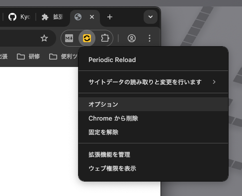
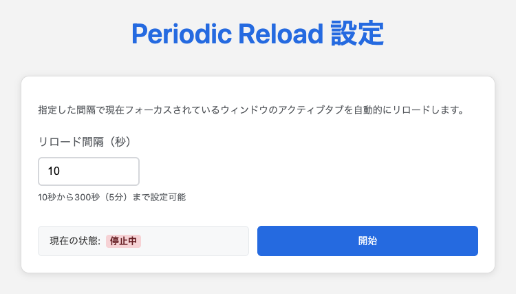

# Periodic Reload

指定した間隔で現在フォーカスされているウィンドウのアクティブなタブを自動的にリロードする Chrome 拡張です。

## 導入方法

Comming Soon

## 使用方法

### 1. Chrome 拡張機能の Periodic Reload の項目からオプションを開く。

### 2. リロードしたい間隔を指定し、開始する。

## LICENSE

[MIT](https://github.com/Kyome22/periodic-reload/blob/main/LICENSE)
